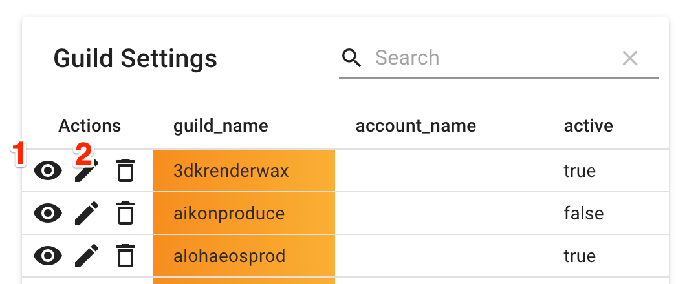
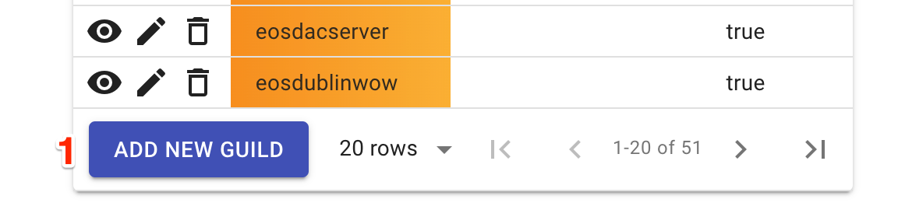

# Admin page

## Minimum tech score 

Is the minimum score required for OIG to quality as standby guilds. The score is adjustable by the OIG and will be used within the portal to display the status of a guild.

## Trigger metasnapshot

Pressing this button will trigger a metasnapshot.

Metasnapshots which is manually triggered by the OIG within the [admin panel](admin.md) take a snapshot of the database as it currently stands. The idea behind this function is to allow the OIG to adjust the scoring for each Guild and once satisfied with the results, save these results. Each metasnapshot that is created can be accessed, re-edited and re-saved to account for any appeals that occur before the final score is published.

## Set snapshot date

Each time the technical checks are run, this date is checked and if it falls on that date, those set of results will be **flagged**. When viewing the scores page, the tech results shown are the latest **flagged** tech results.

## Editing Guilds

* Allows the OIG to edit existing guilds.
    - 1.Set Guilds to active or inactive. Inactive Guilds are considered retired and will no longer be checked or shown in most areas on the portal.
    - 2.Edit Guilds to change account_name or also set guilds active or inactive. 

* Allows the OIG to add new guilds.
    - 1.The button allows the OIG to add new guilds. Even though the system is configured to pick up new guilds automatically from chain, this option is still available for now.

## Editing scores

* Allows the OIG to edit the scoring in use by the system.
    - 1.Click on the edit button to adjust the scores.
* Technical scores can be changed as following:
    - 2.1 Adjust the points attached to each technical score.
    - 2.2 Adjust the multiple attached to each technical score.
    - 2.3 Set whether the technical score is considered a minimum requirement.

